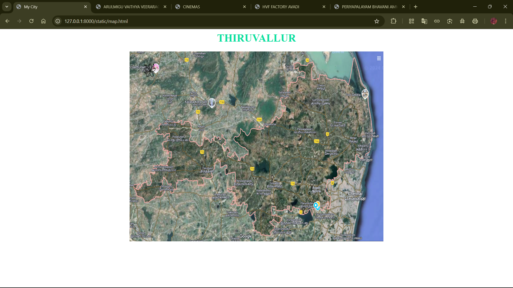
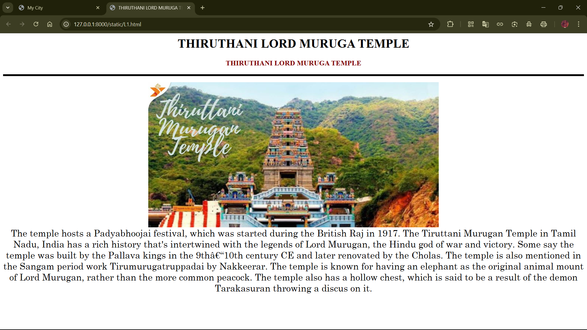
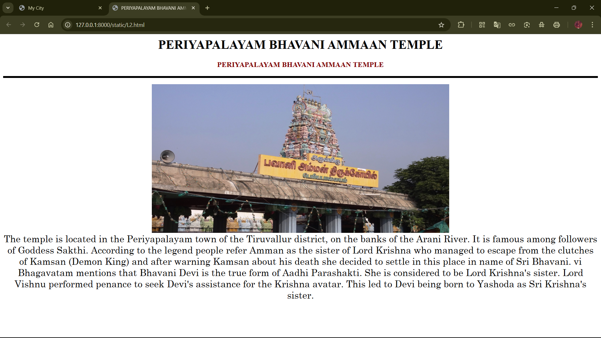
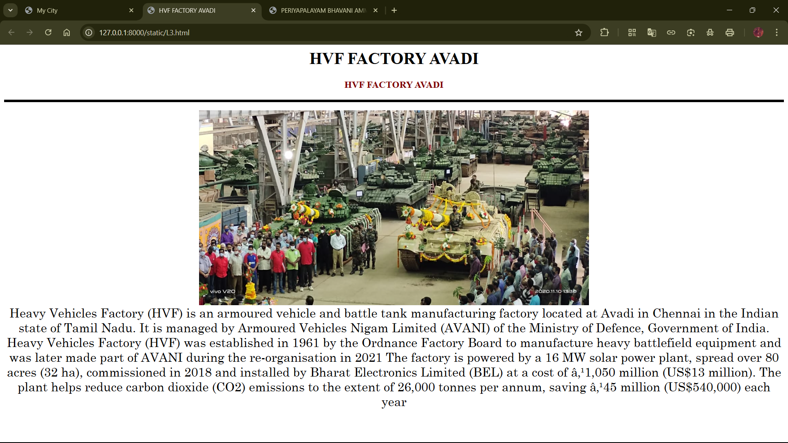
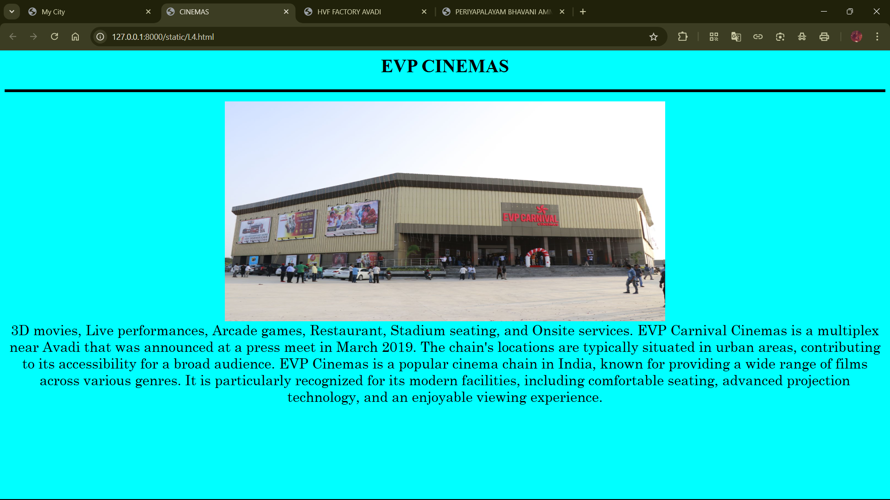

# Ex04 Places Around Me
## Date: 25-11-2024

## AIM
To develop a website to display details about the places around my house.

## DESIGN STEPS

### STEP 1
Create a Django admin interface.

### STEP 2
Download your city map from Google.

### STEP 3
Using ```<map>``` tag name the map.

### STEP 4
Create clickable regions in the image using ```<area>``` tag.

### STEP 5
Write HTML programs for all the regions identified.

### STEP 6
Execute the programs and publish them.

## CODE

L1.html:
```
<html>
    <head>
        <title>THIRUTHANI LORD MURUGA TEMPLE</title>
    </head>
    <body bgcolor="white">
        <h1 align="center">
        <font color="black"><b>THIRUTHANI LORD MURUGA TEMPLE</b></font>
        </h1>
        <h3 align="center">
        <font color="maroon"><b>THIRUTHANI LORD MURUGA TEMPLE</b></font>
        </h3>
        <hr size="5" color="black">
        <p align="justify">
        
            <center> </center>

        <font face="Century Schoolbook" size="5">
            <center>The temple hosts a Padyabhoojai festival, which was started during the British Raj in 1917.
                The Tiruttani Murugan Temple in Tamil Nadu, India has a rich history that's intertwined with the legends of Lord Murugan, 
                the Hindu god of war and victory.
                Some say the temple was built by the Pallava kings in the 9th–10th century CE and later renovated by the Cholas. 
                The temple is also mentioned in the Sangam period work Tirumurugatruppadai by Nakkeerar.
                The temple is known for having an elephant as the original animal mount of Lord Murugan, 
                rather than the more common peacock. The temple also has a hollow chest, 
                which is said to be a result of the demon Tarakasuran throwing a discus on it.</center>
        </font>
        </p>
    </body>
</html>
```


L2.html:
```
<html>
    <head>
        <title>PERIYAPALAYAM BHAVANI AMMAAN TEMPLE</title>
    </head>
    <body bgcolor="white">
        <h1 align="center">
        <font color="black"><b>PERIYAPALAYAM BHAVANI AMMAAN TEMPLE</b></font>
        </h1>
        <h3 align="center">
        <font color="maroon"><b>PERIYAPALAYAM BHAVANI AMMAAN TEMPLE</b></font>
        </h3>
        <hr size="5" color="black">
        <p align="justify">
        
            <center> </center>

        <font face="Century Schoolbook" size="5">
            <center>The temple is located in the Periyapalayam town of the Tiruvallur district, on the banks of the Arani River. 
                It is famous among followers of Goddess Sakthi.
                According to the legend people refer Amman as the sister of Lord Krishna who managed to escape from the clutches of Kamsan (Demon King) 
                and after warning Kamsan about his death she decided to settle in this place in name of Sri Bhavani.
                vi Bhagavatam mentions that Bhavani Devi is the true form of Aadhi Parashakti. She is considered to be Lord Krishna's sister. 
                Lord Vishnu performed penance to seek Devi's assistance for the Krishna avatar. 
                This led to Devi being born to Yashoda as Sri Krishna's sister.</center>
        </font>
        </p>
    </body>
</html>
```


L3.html:
```
<html>
    <head>
        <title>HVF FACTORY AVADI</title>
    </head>
    <body bgcolor="white">
        <h1 align="center">
        <font color="black"><b>HVF FACTORY AVADI</b></font>
        </h1>
        <h3 align="center">
        <font color="maroon"><b>HVF FACTORY AVADI</b></font>
        </h3>
        <hr size="5" color="black">
        <p align="justify">
        
            <center> </center>

        <font face="Century Schoolbook" size="5">
            <center>Heavy Vehicles Factory (HVF) is an armoured vehicle and battle tank manufacturing factory located at Avadi in Chennai in the Indian state of Tamil Nadu.
                It is managed by Armoured Vehicles Nigam Limited (AVANI) of the Ministry of Defence, Government of India.
                Heavy Vehicles Factory (HVF) was established in 1961 by the Ordnance Factory Board to manufacture heavy battlefield equipment and was later made part of AVANI during the re-organisation in 2021
                The factory is powered by a 16 MW solar power plant, spread over 80 acres (32 ha), commissioned in 2018 and installed by Bharat Electronics Limited (BEL) at a cost of ₹1,050 million (US$13 million). 
                The plant helps reduce carbon dioxide (CO2) emissions to the extent of 26,000 tonnes per annum, saving ₹45 million (US$540,000) each year</center>
        </font>
        </p>
    </body>
</html>
```


L4.html:
```

<html>
    <head>
        <title>CINEMAS</title>
    </head>
    <body bgcolor="cyan">
        <h1 align="center">
        <font color="black"><b>EVP CINEMAS </b></font>
        </h1>
        
        <hr size="5" color="black">
        <p align="justify">
            
            <center> </center>

        <font face="Century Schoolbook" size="5">
            <center>3D movies, Live performances, Arcade games, Restaurant, Stadium seating, and Onsite services.
            EVP Carnival Cinemas is a multiplex near Avadi that was announced at a press meet in March 2019.
            The chain's locations are typically situated in urban areas, contributing to its accessibility for a broad audience.
            EVP Cinemas is a popular cinema chain in India, known for providing a wide range of films across various genres. 
            It is particularly recognized for its modern facilities, including comfortable seating, advanced projection technology, and an enjoyable viewing experience. </center>
        </font>
        </p>
    </body>
</html>
```


L5.html:
```
<html>
    <head>
        <title>ARULMIGU VAITHYA VEERARAGHAVA PERUMAL TEMPLE</title>
    </head>
    <body bgcolor="white">
        <h1 align="center">
        <font color="black"><b>ARULMIGU VAITHYA VEERARAGHAVA PERUMAL TEMPLE</b></font>
        </h1>
        <h3 align="center">
        <font color="maroon"><b>ARULMIGU VAITHYA VEERARAGHAVA PERUMAL TEMPLE</b></font>
        </h3>
        <hr size="5" color="black">
        <p align="justify">
        
            <center> </center>

        <font face="Century Schoolbook" size="5">
            <center>Veeraraghava Swamy Temple (or Veerarghavaswamy Temple) is a temple dedicated to the Hindu god Vishnu, located in Tiruvallur, Chennai Metropolitan City, 
                an area and headquarters in Tiruvallur district in the South Indian state of Tamil Nadu. Constructed in Dravidian style of architecture, 
                the temple is glorified in the Divya Prabandham, the early medieval Tamil canon of the Alvar saints from the 6th–9th centuries CE. 
                It is counted as one among the 108 Divya Desams dedicated to Vishnu. 
                Vishnu is worshipped as Veeraraghava Perumal, and his consort Lakshmi as Kanakavalli Thayar.
                The temple is originally believed to have been built by the Pallavas during the 8th century.
                The temple is believed to be of significant antiquity and is believed to be initiated by the Pallavas of the late 8th century CE, 
                with later contributions at different times from Thanjavur Nayaks. 
                The temple has three inscriptions dating from the Chola period. 
                The temple has a seven-tiered rajagopuram (gateway tower) and enshrined within a granite wall.</center>
        </font>
        </p>
    </body>
</html>
```


map.html:
```
<html>
    <head>
        <title>
            My City
        </title>
    </head>
    <body>
        <h1 align="center">
            <font color="magenda"><b>THIRUVALLUR</b></font>
        </h1>
        
        <center>
            
    


    <map name="image-map">    
            <area target="_blank" alt="THIRUTHANI LORD MURUGA TEMPLE " title="THIRUTHANI LORD MURUGA TEMPLE" href="L1.html" coords="205,330,259,369" shape="rect">
            <area target="_blank" alt="PERIYAPALAYAM BHAVANI AMMAAN TEMPLE" title="PERIYAPALAYAM BHAVANI AMMAAN TEMPLE" href="L2.html" coords="505,225,545,255" shape="rect">
            <area target="_blank" alt="HVF FACTORY AVADI" title="HVF FACTORY AVADI" href="L3.html" coords="530,385,580,430" shape="rect">
            <area target="_blank" alt="EVP CINEMAS" title="EVP CINEMAS" href="L4.html" coords="505,465,535,485" shape="rect">
            <area target="_blank" alt="ARULMIGU VAITHYA VEERARAGHAVA PERUMAL TEMPLE" title="ARULMIGU VAITHYA VEERARAGHAVA PERUMAL TEMPLE" href="L5.html" coords="399,359,450,408" shape="rect">
    </map>

        </center>
    </body>

</html>
```

## OUTPUT







## RESULT
The program for implementing image maps using HTML is executed successfully.
